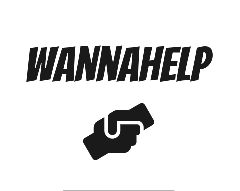
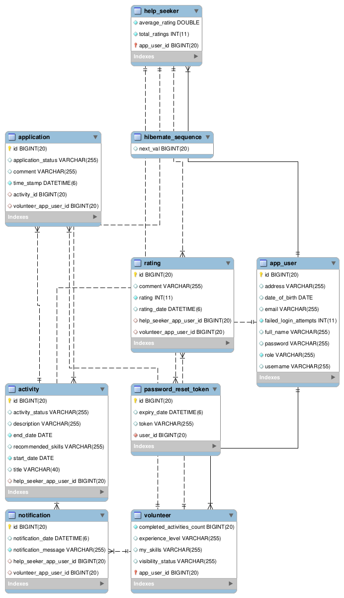

# WELCOME TO OUR PROJECT 

| **Contributors**                                                 |
|------------------------------------------------------------------|
| **Catherine Schlienger** [GitHub](https://github.com/catEvasion) |     
| **Erik Pavlusik** [GitHub](https://github.com/epavlusik)         |
| **Mhd Hasan Yahya** [GitHub](https://github.com/Mhd-Hasan-Yahya) |
| **Tomi Fekete** [GitHub](https://github.com/TomiFekete)          |

# Volunteer Connection Platform

The Volunteer Connection Platform is an application designed to connect individuals in need, known as help seekers, with volunteers. The platform aims to facilitate the process of finding suitable volunteers and coordinating activities efficiently.

| Feature                                     | Description                                                                                            | UI Design                                                                                                                                                                                                                                                                                                 |
|---------------------------------------------| ------------------------------------------------------------------------------------------------------ |-----------------------------------------------------------------------------------------------------------------------------------------------------------------------------------------------------------------------------------------------------------------------------------------------------------|
| User Registration and Account Creation      | Individuals can sign up and create their own personalized accounts within the application, enabling a tailored experience. | [registraion](wanna-help/pictures/Ui_Design/wannaHelp_registraion.png)                                                                                                                                                                   |
| User Login and Password Recovery            | Registered users can easily log into their accounts, and in case they forget their password, they can initiate a secure password recovery process. | [login](wanna-help/pictures/Ui_Design/wannaHelp_login.png) & [password](wanna-help/pictures/Ui_Design/wannaHelp_passwordreset.png)                                       |
| Logout Feature                              | Users can log out from their accounts to safeguard their personal information and ensure privacy.       | [logout](wanna-help/pictures/Ui_Design/wannaHelp_singout.png)                                                                                                                                                                            |
| Profile Management                          | Both volunteers and help seekers have the ability to manage their profiles. Volunteers can showcase their skills and expertise, while help seekers can update their profiles to accurately communicate their needs. | [helpseeker-profile](wanna-help/pictures/Ui_Design/wannaHelp_helpseekerProfile.png) & [volunteeer-profile](wanna-help/pictures/Ui_Design/wannaHelp_volunteerProfile.png) |
| Activity Creation and Publication           | Help seekers can create activities, describing the assistance they need. Once published, activities become visible to volunteers, who can browse and apply for them. | [activity](wanna-help/pictures/Ui_Design/wannaHelp_activityCreation.png)                                                                                                                                                                 |
| Volunteer Application Process               | Volunteers can review published activities, submit applications, and track their application status. | [application](wanna-help/pictures/Ui_Design/wannaHelp_apply.png)                                                                                                                                                                         |
| Help seekers Assess and Manage Applications | Help seekers can assess and manage volunteer applications to choose the most suitable candidate.          | [manage application](wanna-help/pictures/Ui_Design/wannaHelp_acceptDecline.png)                                                                                                                                                          |
| Rating System                               | Volunteers can rate organizations or individuals they assisted, providing valuable feedback to help future volunteers choose activities. | [rating](wanna-help/pictures/Ui_Design/wannaHelp_rating.png)                                                                                                                                                                             |
| Search Functionality                        | Help seekers can search for volunteers based on their skills and batch level. The batch level is a point-based system that reflects a volunteer's experience and activity completion. | [search](wanna-help/pictures/Ui_Design/wannaHelp_search.png)                                                                                                                                                                             |
| Invitation System                           | Help seekers can send personalized invitations to specific volunteers for particular activities, using a convenient email-based invitation system. | [invitation](wanna-help/pictures/Ui_Design/wannaHelp_invite.png) & [notification](wanna-help/pictures/Ui_Design/wannaHelp_notification.png)                             |

Please note that the UX designs for these features were provided by our talented Product Owner. -> **Ovidiu Buhutan**

## Conclusion

The Volunteer Connection Platform has implemented several key features to connect help seekers with volunteers and organizations effectively. By providing a user-friendly functionality such as registration, activity creation, profile management, and an invitation system, the platform aims to streamline the process of finding and coordinating volunteers for activities.

## Demo Videos

To better understand the features and functionality of the Volunteer Connection Platform, please refer to the following demo videos:

- [User Registration and Account Creation](link_to_video_1)
- [Creating an Activity](link_to_video_2)
- [Profile Management](link_to_video_3)

## Technologies and Frameworks

- Java 11
- Spring Boot
- Spring Boot Data JPA
- Spring Boot Security
- Spring Boot Validation
- Spring Boot Web
- MySQL
- H2 Database (for testing)
- Spring Boot DevTools
- Spring Boot Test
- Spring Security Test
- JUnit
- Spring Boot Starter Mail

## Testing

## Database Structure

Here is the diagram showcasing the structure of our database:

